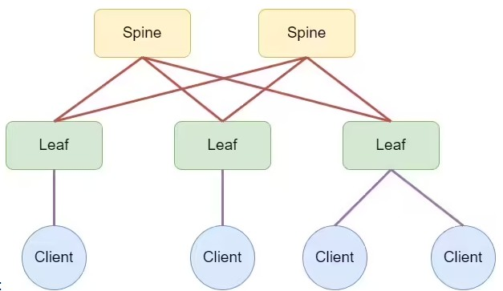
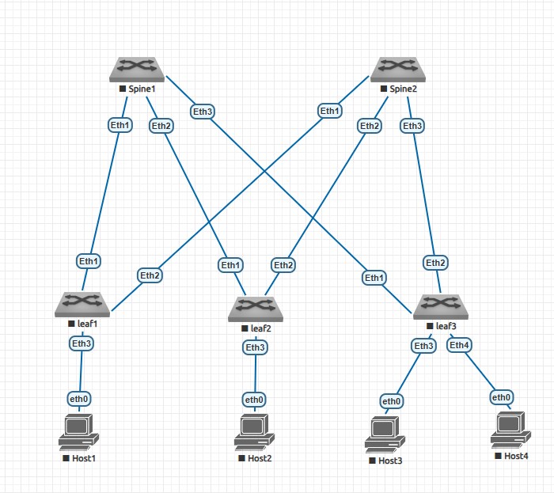

# Проектирование адресного пространства
# Цель:
* Собрать схему CLOS;
* Распределить адресное пространство.

# Описание/Пошаговая инструкция выполнения домашнего задания:
1. Собрать топологию CLOS, как на схеме:

2. Распределите адресное пространство для Underlay сети

# Выполнение:

# Собранная схема

# Таблица адресации:

| Device  | Interface    | IP Address     | Description                |
|:--------|:-------------|:---------------|:---------------------------|
| Spine1  | Loopback0    | 10.0.0.1/32    | Underlay BGP Router-ID     |
|         | Loopback1    | 10.0.1.1/32    | VTEP        |
|         | Eth1  | 10.0.2.0/31    | P2P линк к Leaf1          |
|         | Eth2  | 10.0.2.2/31    | P2P линк к Leaf2          |
|         | Eth3  | 10.0.2.4/31    | P2P линк к Leaf3          |
|         |              |                |                            |
| Spine2  | Loopback0    | 10.0.0.2/32    | Underlay BGP Router-ID     |
|         | Loopback1    | 10.0.1.2/32    | VTEP       |
|         | Eth1  | 10.0.2.6/31    | P2P линк к Leaf1          |
|         | Eth2  | 10.0.2.8/31    | P2P линк к Leaf2          |
|         | Eth3  | 10.0.2.10/31   | P2P линк к Leaf3          |
|         |              |                |                            |
| Leaf1   | Loopback0    | 10.0.0.11/32   | Underlay BGP Router-ID     |
|         | Loopback1    | 10.0.1.11/32   | VTEP address  |
|         | Eth1  | 10.0.2.1/31    | P2P линк к Spine1         |
|         | Eth2  | 10.0.2.7/31    | P2P линк к Spine2         |
|         |              |                |                            |
| Leaf2   | Loopback0    | 10.0.0.12/32   | Underlay BGP Router-ID     |
|         | Loopback1    | 10.0.1.12/32   | VTEP address  |
|         | Eth1  | 10.0.2.3/31    | P2P линк к Spine1         |
|         | Eth2  | 10.0.2.9/31    | P2P линк к Spine2         |
|         |              |                |                            |
| Leaf3   | Loopback0    | 10.0.0.13/32   | Underlay BGP Router-ID     |
|         | Loopback1    | 10.0.1.13/32   | VTEP address   |
|         | Eth1  | 10.0.2.5/31    | P2P линк к Spine1         |
|         | Eth2  | 10.0.2.11/31   | P2P линк к Spine2         |
