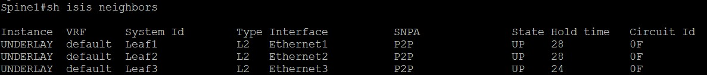
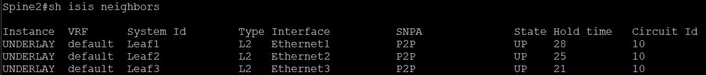
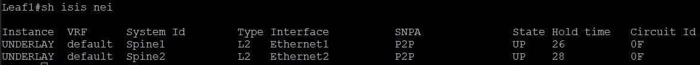
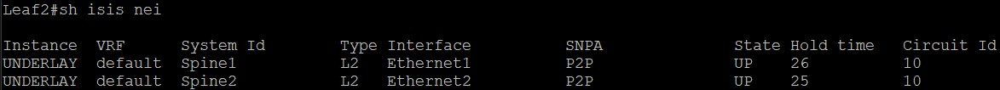
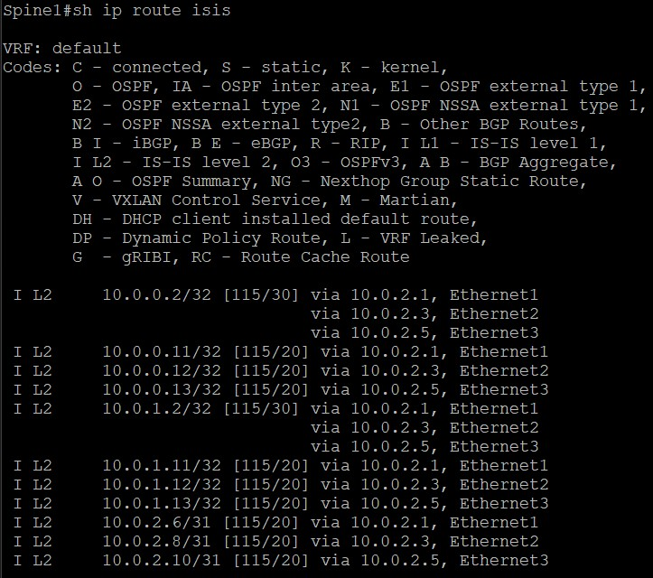
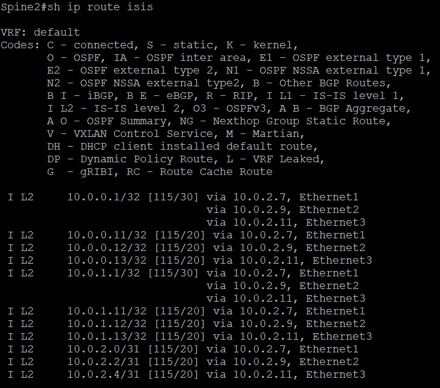
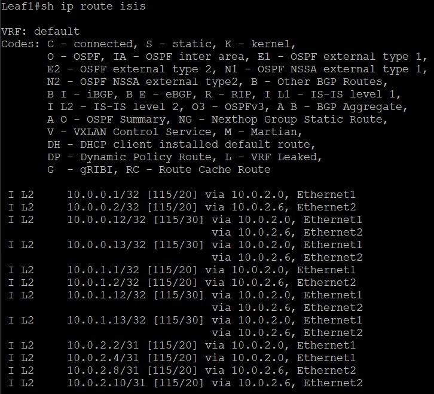
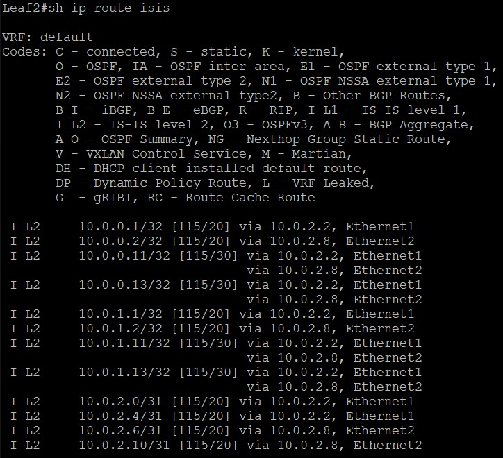
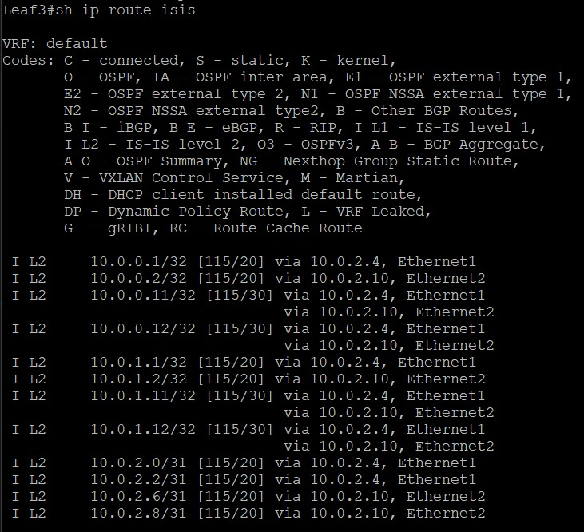

# Построение Underlay сети(IS-IS)
# Цель:
* Настроить IS-IS для Underlay сети.

# Описание/Пошаговая инструкция выполнения домашнего задания:
1. Настройка IS-IS в Underlay сети, для IP связанности между всеми сетевыми устройствами.
2. Зафиксируете в документации - план работы, адресное пространство, схему сети, конфигурацию устройств
3. Убедитесь в наличии IP связанности между устройствами в IS-IS домене


# Выполнение:

## Таблица адресации:


| Device  | Interface    | IP Address     | Description                |
|:--------|:-------------|:---------------|:---------------------------|
| Spine1  | Loopback0    | 10.0.0.1/32    | Underlay BGP Router-ID     |
|         | Loopback1    | 10.0.1.1/32    | VTEP        |
|         | Eth1  | 10.0.2.0/31    | P2P линк к Leaf1          |
|         | Eth2  | 10.0.2.2/31    | P2P линк к Leaf2          |
|         | Eth3  | 10.0.2.4/31    | P2P линк к Leaf3          |
|         |              |                |                            |
| Spine2  | Loopback0    | 10.0.0.2/32    | Underlay BGP Router-ID     |
|         | Loopback1    | 10.0.1.2/32    | VTEP       |
|         | Eth1  | 10.0.2.6/31    | P2P линк к Leaf1          |
|         | Eth2  | 10.0.2.8/31    | P2P линк к Leaf2          |
|         | Eth3  | 10.0.2.10/31   | P2P линк к Leaf3          |
|         |              |                |                            |
| Leaf1   | Loopback0    | 10.0.0.11/32   | Underlay BGP Router-ID     |
|         | Loopback1    | 10.0.1.11/32   | VTEP address  |
|         | Eth1  | 10.0.2.1/31    | P2P линк к Spine1         |
|         | Eth2  | 10.0.2.7/31    | P2P линк к Spine2         |
|         |              |                |                            |
| Leaf2   | Loopback0    | 10.0.0.12/32   | Underlay BGP Router-ID     |
|         | Loopback1    | 10.0.1.12/32   | VTEP address  |
|         | Eth1  | 10.0.2.3/31    | P2P линк к Spine1         |
|         | Eth2  | 10.0.2.9/31    | P2P линк к Spine2         |
|         |              |                |                            |
| Leaf3   | Loopback0    | 10.0.0.13/32   | Underlay BGP Router-ID     |
|         | Loopback1    | 10.0.1.13/32   | VTEP address   |
|         | Eth1  | 10.0.2.5/31    | P2P линк к Spine1         |
|         | Eth2  | 10.0.2.11/31   | P2P линк к Spine2         |


## Конфигурации устрайств(Также в формате файлов в папке проекта):

### Конфигурация Spine1:

```
! device: Spine1 (vEOS-lab, EOS-4.29.2F)
!
! boot system flash:/vEOS-lab.swi
!
no aaa root
!
transceiver qsfp default-mode 4x10G
!
service routing protocols model ribd
!
hostname Spine1
!
spanning-tree mode mstp
!
interface Ethernet1
   description p2p-leaf1
   mtu 8000
   no switchport
   ip address 10.0.2.0/31
   bfd interval 1200 min-rx 1200 multiplier 3
   isis enable UNDERLAY
   isis bfd
   isis network point-to-point
!
interface Ethernet2
   description p2p-leaf2
   mtu 8000
   no switchport
   ip address 10.0.2.2/31
   bfd interval 1200 min-rx 1200 multiplier 3
   isis enable UNDERLAY
   isis bfd
   isis network point-to-point
!
interface Ethernet3
   description p2p-leaf3
   mtu 8000
   no switchport
   ip address 10.0.2.4/31
   bfd interval 1200 min-rx 1200 multiplier 3
   isis enable UNDERLAY
   isis bfd
   isis network point-to-point
!
interface Ethernet4
!
interface Ethernet5
!
interface Ethernet6
!
interface Ethernet7
!
interface Ethernet8
!
interface Loopback0
   description Router-ID
   ip address 10.0.0.1/32
   isis enable UNDERLAY
   no isis bfd
!
interface Loopback1
   description VTEP
   ip address 10.0.1.1/32
   isis enable UNDERLAY
!
interface Management1
!
ip routing
!
router isis UNDERLAY
   net 49.0001.0000.0000.0001.00
   is-type level-2
   log-adjacency-changes
   !
   address-family ipv4 unicast
      bfd all-interfaces
!
end


```

### Конфигурация Spine2:

```
! device: Spine2 (vEOS-lab, EOS-4.29.2F)
!
! boot system flash:/vEOS-lab.swi
!
no aaa root
!
transceiver qsfp default-mode 4x10G
!
service routing protocols model ribd
!
hostname Spine2
!
spanning-tree mode mstp
!
interface Ethernet1
   description p2p-leaf1
   mtu 8000
   no switchport
   ip address 10.0.2.6/31
   bfd interval 1200 min-rx 1200 multiplier 3
   isis enable UNDERLAY
   isis bfd
   isis network point-to-point
!
interface Ethernet2
   description p2p-leaf2
   mtu 8000
   no switchport
   ip address 10.0.2.8/31
   bfd interval 1200 min-rx 1200 multiplier 3
   isis enable UNDERLAY
   isis bfd
   isis network point-to-point
!
interface Ethernet3
   description p2p-leaf3
   mtu 8000
   no switchport
   ip address 10.0.2.10/31
   bfd interval 1200 min-rx 1200 multiplier 3
   isis enable UNDERLAY
   isis bfd
   isis network point-to-point
!
interface Ethernet4
!
interface Ethernet5
!
interface Ethernet6
!
interface Ethernet7
!
interface Ethernet8
!
interface Loopback0
   description Router-ID
   ip address 10.0.0.2/32
   isis enable UNDERLAY
!
interface Loopback1
   description VTEP
   ip address 10.0.1.2/32
   isis enable UNDERLAY
!
interface Management1
!
ip routing
!
router isis UNDERLAY
   net 49.0001.0000.0000.0002.00
   is-type level-2
   log-adjacency-changes
   !
   address-family ipv4 unicast
      bfd all-interfaces
!
end


```

### Конфигурация Leaf1:

```
! device: Leaf1 (vEOS-lab, EOS-4.29.2F)
!
! boot system flash:/vEOS-lab.swi
!
no aaa root
!
transceiver qsfp default-mode 4x10G
!
service routing protocols model ribd
!
hostname Leaf1
!
spanning-tree mode mstp
!
interface Ethernet1
   description p2p-spine1
   mtu 8000
   no switchport
   ip address 10.0.2.1/31
   bfd interval 1200 min-rx 1200 multiplier 3
   isis enable UNDERLAY
   isis bfd
   isis network point-to-point
!
interface Ethernet2
   description p2p-spine2
   mtu 8000
   no switchport
   ip address 10.0.2.7/31
   bfd interval 1200 min-rx 1200 multiplier 3
   isis enable UNDERLAY
   isis bfd
   isis network point-to-point
!
interface Ethernet3
!
interface Ethernet4
!
interface Ethernet5
!
interface Ethernet6
!
interface Ethernet7
!
interface Ethernet8
!
interface Loopback0
   description Router-ID
   ip address 10.0.0.11/32
   isis enable UNDERLAY
!
interface Loopback1
   description VTEP
   ip address 10.0.1.11/32
   isis enable UNDERLAY
!
interface Management1
!
ip routing
!
router isis UNDERLAY
   net 49.0001.0000.0000.0011.00
   is-type level-2
   log-adjacency-changes
   !
   address-family ipv4 unicast
      bfd all-interfaces
!
end


```

### Конфигурация Leaf2:

```
! device: Leaf2 (vEOS-lab, EOS-4.29.2F)
!
! boot system flash:/vEOS-lab.swi
!
no aaa root
!
transceiver qsfp default-mode 4x10G
!
service routing protocols model ribd
!
hostname Leaf2
!
spanning-tree mode mstp
!
interface Ethernet1
   description p2p-spine1
   mtu 8000
   no switchport
   ip address 10.0.2.3/31
   bfd interval 1200 min-rx 1200 multiplier 3
   isis enable UNDERLAY
   isis bfd
   isis network point-to-point
!
interface Ethernet2
   description p2p-spine2
   mtu 8000
   no switchport
   ip address 10.0.2.9/31
   bfd interval 1200 min-rx 1200 multiplier 3
   isis enable UNDERLAY
   isis bfd
   isis network point-to-point
!
interface Ethernet3
!
interface Ethernet4
!
interface Ethernet5
!
interface Ethernet6
!
interface Ethernet7
!
interface Ethernet8
!
interface Loopback0
   description Routed-ID
   ip address 10.0.0.12/32
   isis enable UNDERLAY
!
interface Loopback1
   description VTEP
   ip address 10.0.1.12/32
   isis enable UNDERLAY
!
interface Management1
!
ip routing
!
router isis UNDERLAY
   net 49.0001.0000.0000.0021.00
   is-type level-2
   log-adjacency-changes
   !
   address-family ipv4 unicast
      bfd all-interfaces
!
end


```

### Конфигурация Leaf3:

```
! device: Leaf3 (vEOS-lab, EOS-4.29.2F)
!
! boot system flash:/vEOS-lab.swi
!
no aaa root
!
transceiver qsfp default-mode 4x10G
!
service routing protocols model ribd
!
hostname Leaf3
!
spanning-tree mode mstp
!
interface Ethernet1
   description p2p-spine1
   mtu 8000
   no switchport
   ip address 10.0.2.5/31
   bfd interval 1200 min-rx 1200 multiplier 3
   isis enable UNDERLAY
   isis bfd
   isis network point-to-point
!
interface Ethernet2
   description p2p-spine2
   mtu 8000
   no switchport
   ip address 10.0.2.11/31
   bfd interval 1200 min-rx 1200 multiplier 3
   isis enable UNDERLAY
   isis bfd
   isis network point-to-point
!
interface Ethernet3
!
interface Ethernet4
!
interface Ethernet5
!
interface Ethernet6
!
interface Ethernet7
!
interface Ethernet8
!
interface Loopback0
   description Router-ID
   ip address 10.0.0.13/32
   isis enable UNDERLAY
!
interface Loopback1
   description VTEP
   ip address 10.0.1.13/32
   isis enable UNDERLAY
!
interface Management1
!
ip routing
!
router isis UNDERLAY
   net 49.0001.0000.0000.0031.00
   is-type level-2
   log-adjacency-changes
   !
   address-family ipv4 unicast
      bfd all-interfaces
!
end


```

### Проверка:

1. Вывод команды sh isis neighbors:

    1.1. На Spine1:

    

    ✅Все Leaf-узлы видны

    1.2. На Spine2:

    

    ✅Все Leaf-узлы видны

    1.3. На Leaf1:

    

    ✅Все Spine-узлы видны

    1.4. На Leaf2:

    

    ✅Все Spine-узлы видны

    1.5. На Leaf3:

    

    ✅Все Spine-узлы видны

2. Проверка наличия маршрутов:

    2.1. На Spine1:

    

    ✅Все Leaf-узлы отвечают

    2.2. На Spine2:

    

    ✅Все Leaf-узлы отвечают

    2.3. На Leaf1:

    

    ✅Все Spine-узлы отвечают

    2.4. На Leaf2:

    

    ✅Все Spine-узлы отвечают

    2.5. На Leaf3:

    

    ✅Все Spine-узлы отвечают

    

    

    
        