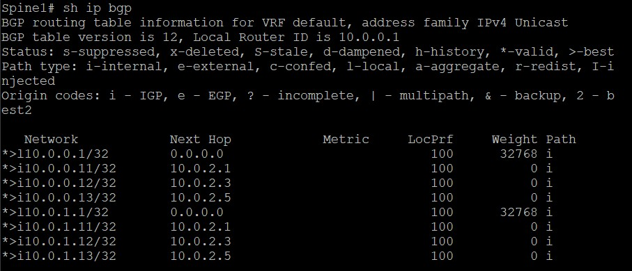
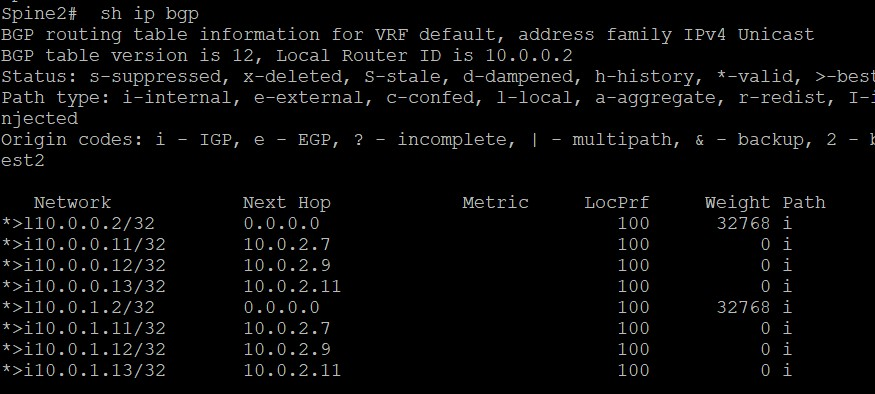
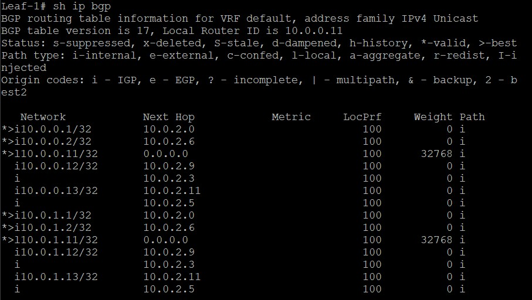
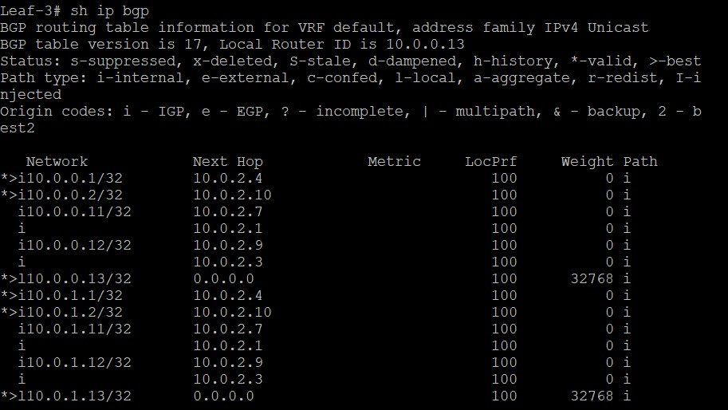

# Построение Underlay сети(BGP)
# Цель:
* Настроить BGP для Underlay сети.

# Описание/Пошаговая инструкция выполнения домашнего задания:
1. Настройка BGP в Underlay сети, для IP связанности между всеми сетевыми устройствами.
2. Зафиксируете в документации - план работы, адресное пространство, схему сети, конфигурацию устройств
3. Убедитесь в наличии IP связанности между устройствами в BGP домене


# Выполнение на NX-OS:

## Таблица адресации:

Будем использовать iBGP AS 65500

| Device  | Interface    | IP Address     | Description                |
|:--------|:-------------|:---------------|:---------------------------|
| Spine1  | Loopback0    | 10.0.0.1/32    | Underlay BGP Router-ID     |
|         | Loopback1    | 10.0.1.1/32    | VTEP        |
|         | Eth1  | 10.0.2.0/31    | P2P линк к Leaf1          |
|         | Eth2  | 10.0.2.2/31    | P2P линк к Leaf2          |
|         | Eth3  | 10.0.2.4/31    | P2P линк к Leaf3          |
|         |              |                |                            |
| Spine2  | Loopback0    | 10.0.0.2/32    | Underlay BGP Router-ID     |
|         | Loopback1    | 10.0.1.2/32    | VTEP       |
|         | Eth1  | 10.0.2.6/31    | P2P линк к Leaf1          |
|         | Eth2  | 10.0.2.8/31    | P2P линк к Leaf2          |
|         | Eth3  | 10.0.2.10/31   | P2P линк к Leaf3          |
|         |              |                |                            |
| Leaf1   | Loopback0    | 10.0.0.11/32   | Underlay BGP Router-ID     |
|         | Loopback1    | 10.0.1.11/32   | VTEP address  |
|         | Eth1  | 10.0.2.1/31    | P2P линк к Spine1         |
|         | Eth2  | 10.0.2.7/31    | P2P линк к Spine2         |
|         |              |                |                            |
| Leaf2   | Loopback0    | 10.0.0.12/32   | Underlay BGP Router-ID     |
|         | Loopback1    | 10.0.1.12/32   | VTEP address  |
|         | Eth1  | 10.0.2.3/31    | P2P линк к Spine1         |
|         | Eth2  | 10.0.2.9/31    | P2P линк к Spine2         |
|         |              |                |                            |
| Leaf3   | Loopback0    | 10.0.0.13/32   | Underlay BGP Router-ID     |
|         | Loopback1    | 10.0.1.13/32   | VTEP address   |
|         | Eth1  | 10.0.2.5/31    | P2P линк к Spine1         |
|         | Eth2  | 10.0.2.11/31   | P2P линк к Spine2         |


## Конфигурации устрайств(Также в формате файлов в папке проекта):

### Конфигурация Spine1:

```


version 10.5(2) Bios:version
hostname Spine1
vdc Spine1 id 1
  limit-resource vlan minimum 16 maximum 4094
  limit-resource vrf minimum 2 maximum 4096
  limit-resource port-channel minimum 0 maximum 511
  limit-resource m4route-mem minimum 58 maximum 58
  limit-resource m6route-mem minimum 8 maximum 8

feature bgp

username admin password 5 $5$HMJKFD$p3eXYmGYN7p9HHkoCud9XRN7eYeFncCT7zKDWJhR1A4
 role network-admin
ip domain-lookup
copp profile strict
snmp-server user admin network-admin auth md5 482E8D008CE4E5977FF6A8AA8677F828E6
EA priv aes-128 3319A428BD8BD89931E5FFA4D7268068ACB0 localizedV2key
rmon event 1 log trap public description FATAL(1) owner PMON@FATAL
rmon event 2 log trap public description CRITICAL(2) owner PMON@CRITICAL
rmon event 3 log trap public description ERROR(3) owner PMON@ERROR
rmon event 4 log trap public description WARNING(4) owner PMON@WARNING
rmon event 5 log trap public description INFORMATION(5) owner PMON@INFO

vlan 1

vrf context management

interface Ethernet1/1
  description Leaf-1
  no switchport
  mtu 9216
  ip address 10.0.2.0/31
  no shutdown

interface Ethernet1/2
  description Leaf-2
  no switchport
  mtu 9216
  ip address 10.0.2.2/31
  no shutdown

interface Ethernet1/3
  description Leaf-3
  no switchport
  mtu 9216
  ip address 10.0.2.4/31
  no shutdown

interface Ethernet1/4

interface Ethernet1/5

interface Ethernet1/6

interface Ethernet1/7

interface Ethernet1/8

interface Ethernet1/9

interface Ethernet1/10

interface Ethernet1/11

interface Ethernet1/12

interface Ethernet1/13

interface Ethernet1/14

interface Ethernet1/15

interface Ethernet1/16

interface Ethernet1/17

interface Ethernet1/18

interface Ethernet1/19

interface Ethernet1/20

interface Ethernet1/21

interface Ethernet1/22

interface Ethernet1/23

interface Ethernet1/24

interface Ethernet1/25

interface Ethernet1/26

interface Ethernet1/27

interface Ethernet1/28

interface Ethernet1/29

interface Ethernet1/30

interface Ethernet1/31

interface Ethernet1/32

interface Ethernet1/33

interface Ethernet1/34

interface Ethernet1/35

interface Ethernet1/36

interface Ethernet1/37

interface Ethernet1/38

interface Ethernet1/39

interface Ethernet1/40

interface Ethernet1/41

interface Ethernet1/42

interface Ethernet1/43

interface Ethernet1/44

interface Ethernet1/45

interface Ethernet1/46

interface Ethernet1/47

interface Ethernet1/48

interface Ethernet1/49

interface Ethernet1/50

interface Ethernet1/51

interface Ethernet1/52

interface Ethernet1/53

interface Ethernet1/54

interface Ethernet1/55

interface Ethernet1/56

interface Ethernet1/57

interface Ethernet1/58

interface Ethernet1/59

interface Ethernet1/60

interface Ethernet1/61

interface Ethernet1/62

interface Ethernet1/63

interface Ethernet1/64

interface mgmt0
  vrf member management

interface loopback0
  description Router-ID
  ip address 10.0.0.1/32

interface loopback1
  description VTEP
  ip address 10.0.1.1/32
icam monitor scale

line console
line vty
router bgp 65500
  router-id 10.0.0.1
  address-family ipv4 unicast
    network 10.0.0.1/32
    network 10.0.1.1/32
  neighbor 10.0.2.1
    remote-as 65500
    address-family ipv4 unicast
      route-reflector-client
      next-hop-self
  neighbor 10.0.2.3
    remote-as 65500
    address-family ipv4 unicast
      route-reflector-client
      next-hop-self
  neighbor 10.0.2.5
    remote-as 65500
    address-family ipv4 unicast
      route-reflector-client
      next-hop-self


```

### Конфигурация Spine2:

```


version 10.5(2) Bios:version
hostname Spine2
vdc Spine2 id 1
  limit-resource vlan minimum 16 maximum 4094
  limit-resource vrf minimum 2 maximum 4096
  limit-resource port-channel minimum 0 maximum 511
  limit-resource m4route-mem minimum 58 maximum 58
  limit-resource m6route-mem minimum 8 maximum 8

feature bgp

username admin password 5 $5$FDLIPO$Gu.QblJI3kuL3tsUiYiG8J.zz.UgPBVkgS2kJCOzut1
 role network-admin
ip domain-lookup
copp profile strict
snmp-server user admin network-admin auth md5 205A6E41A0E126ACAA2E557E043BFFB5E2
FE priv aes-128 01764B6FEDD56AD6B6583F725E7ABFF1C18E localizedV2key
rmon event 1 log trap public description FATAL(1) owner PMON@FATAL
rmon event 2 log trap public description CRITICAL(2) owner PMON@CRITICAL
rmon event 3 log trap public description ERROR(3) owner PMON@ERROR
rmon event 4 log trap public description WARNING(4) owner PMON@WARNING
rmon event 5 log trap public description INFORMATION(5) owner PMON@INFO

vlan 1

vrf context management

interface Ethernet1/1
  description Leaf-1
  no switchport
  mtu 9216
  ip address 10.0.2.6/31
  no shutdown

interface Ethernet1/2
  description Leaf-2
  no switchport
  mtu 9216
  ip address 10.0.2.8/31
  no shutdown

interface Ethernet1/3
  description Leaf-3
  no switchport
  mtu 9216
  ip address 10.0.2.10/31
  no shutdown

interface Ethernet1/4

interface Ethernet1/5

interface Ethernet1/6

interface Ethernet1/7

interface Ethernet1/8

interface Ethernet1/9

interface Ethernet1/10

interface Ethernet1/11

interface Ethernet1/12

interface Ethernet1/13

interface Ethernet1/14

interface Ethernet1/15

interface Ethernet1/16

interface Ethernet1/17

interface Ethernet1/18

interface Ethernet1/19

interface Ethernet1/20

interface Ethernet1/21

interface Ethernet1/22

interface Ethernet1/23

interface Ethernet1/24

interface Ethernet1/25

interface Ethernet1/26

interface Ethernet1/27

interface Ethernet1/28

interface Ethernet1/29

interface Ethernet1/30

interface Ethernet1/31

interface Ethernet1/32

interface Ethernet1/33

interface Ethernet1/34

interface Ethernet1/35

interface Ethernet1/36

interface Ethernet1/37

interface Ethernet1/38

interface Ethernet1/39

interface Ethernet1/40

interface Ethernet1/41

interface Ethernet1/42

interface Ethernet1/43

interface Ethernet1/44

interface Ethernet1/45

interface Ethernet1/46

interface Ethernet1/47

interface Ethernet1/48

interface Ethernet1/49

interface Ethernet1/50

interface Ethernet1/51

interface Ethernet1/52

interface Ethernet1/53

interface Ethernet1/54

interface Ethernet1/55

interface Ethernet1/56

interface Ethernet1/57

interface Ethernet1/58

interface Ethernet1/59

interface Ethernet1/60

interface Ethernet1/61

interface Ethernet1/62

interface Ethernet1/63

interface Ethernet1/64

interface mgmt0
  vrf member management

interface loopback0
  description Router-ID
  ip address 10.0.0.2/32

interface loopback1
  description VTEP
  ip address 10.0.1.2/32
icam monitor scale

line console
line vty
router bgp 65500
  router-id 10.0.0.2
  address-family ipv4 unicast
    network 10.0.0.2/32
    network 10.0.1.2/32
  neighbor 10.0.2.7
    remote-as 65500
    address-family ipv4 unicast
      route-reflector-client
      next-hop-self
  neighbor 10.0.2.9
    remote-as 65500
    address-family ipv4 unicast
      route-reflector-client
      next-hop-self
  neighbor 10.0.2.11
    remote-as 65500
    address-family ipv4 unicast
      route-reflector-client
      next-hop-self


```

### Конфигурация Leaf1:

```

version 10.5(2) Bios:version
hostname Leaf-1
vdc Leaf-1 id 1
  limit-resource vlan minimum 16 maximum 4094
  limit-resource vrf minimum 2 maximum 4096
  limit-resource port-channel minimum 0 maximum 511
  limit-resource m4route-mem minimum 58 maximum 58
  limit-resource m6route-mem minimum 8 maximum 8

feature bgp

username admin password 5 $5$PLHDBI$UGHZ1H2R3qxR1S.hxesSlBadO5Q/trvo7v2/9a5NNwD
 role network-admin
ip domain-lookup
copp profile strict
snmp-server user admin network-admin auth md5 0064364E56123B15E0DBDC020E4657D308
69 priv aes-128 205A09774D536D23DDD69012181910930F27 localizedV2key
rmon event 1 log trap public description FATAL(1) owner PMON@FATAL
rmon event 2 log trap public description CRITICAL(2) owner PMON@CRITICAL
rmon event 3 log trap public description ERROR(3) owner PMON@ERROR
rmon event 4 log trap public description WARNING(4) owner PMON@WARNING
rmon event 5 log trap public description INFORMATION(5) owner PMON@INFO

vlan 1

vrf context management

interface Ethernet1/1
  description Spine1
  no switchport
  mtu 9216
  ip address 10.0.2.1/31
  no shutdown

interface Ethernet1/2
  description Spine2
  no switchport
  mtu 9216
  ip address 10.0.2.7/31
  no shutdown

interface Ethernet1/3

interface Ethernet1/4

interface Ethernet1/5

interface Ethernet1/6

interface Ethernet1/7

interface Ethernet1/8

interface Ethernet1/9

interface Ethernet1/10

interface Ethernet1/11

interface Ethernet1/12

interface Ethernet1/13

interface Ethernet1/14

interface Ethernet1/15

interface Ethernet1/16

interface Ethernet1/17

interface Ethernet1/18

interface Ethernet1/19

interface Ethernet1/20

interface Ethernet1/21

interface Ethernet1/22

interface Ethernet1/23

interface Ethernet1/24

interface Ethernet1/25

interface Ethernet1/26

interface Ethernet1/27

interface Ethernet1/28

interface Ethernet1/29

interface Ethernet1/30

interface Ethernet1/31

interface Ethernet1/32

interface Ethernet1/33

interface Ethernet1/34

interface Ethernet1/35

interface Ethernet1/36

interface Ethernet1/37

interface Ethernet1/38

interface Ethernet1/39

interface Ethernet1/40

interface Ethernet1/41

interface Ethernet1/42

interface Ethernet1/43

interface Ethernet1/44

interface Ethernet1/45

interface Ethernet1/46

interface Ethernet1/47

interface Ethernet1/48

interface Ethernet1/49

interface Ethernet1/50

interface Ethernet1/51

interface Ethernet1/52

interface Ethernet1/53

interface Ethernet1/54

interface Ethernet1/55

interface Ethernet1/56

interface Ethernet1/57

interface Ethernet1/58

interface Ethernet1/59

interface Ethernet1/60

interface Ethernet1/61

interface Ethernet1/62

interface Ethernet1/63

interface Ethernet1/64

interface mgmt0
  vrf member management

interface loopback0
  description Router-ID
  ip address 10.0.0.11/32

interface loopback1
  description VTEP
  ip address 10.0.1.11/32
icam monitor scale

line console
line vty
router bgp 65500
  router-id 10.0.0.11
  address-family ipv4 unicast
    network 10.0.0.11/32
    network 10.0.1.11/32
  neighbor 10.0.2.0
    remote-as 65500
    address-family ipv4 unicast
  neighbor 10.0.2.6
    remote-as 65500
    address-family ipv4 unicast


```

### Конфигурация Leaf2:

```


version 10.5(2) Bios:version
hostname Leaf-2
vdc Leaf-2 id 1
  limit-resource vlan minimum 16 maximum 4094
  limit-resource vrf minimum 2 maximum 4096
  limit-resource port-channel minimum 0 maximum 511
  limit-resource m4route-mem minimum 58 maximum 58
  limit-resource m6route-mem minimum 8 maximum 8

feature bgp

username admin password 5 $5$AOALGJ$2PbdVIlSL/QUM1GVgXyzyUkaHrI2kvUyabS3WRYHj26
 role network-admin
ip domain-lookup
copp profile strict
snmp-server user admin network-admin auth md5 0147C07E7413D5FFA6FA3217325425C14E
E1 priv aes-128 041F947B2B29C2BDD2FA247D211F6CC86D89 localizedV2key
rmon event 1 log trap public description FATAL(1) owner PMON@FATAL
rmon event 2 log trap public description CRITICAL(2) owner PMON@CRITICAL
rmon event 3 log trap public description ERROR(3) owner PMON@ERROR
rmon event 4 log trap public description WARNING(4) owner PMON@WARNING
rmon event 5 log trap public description INFORMATION(5) owner PMON@INFO

vlan 1

vrf context management

interface Ethernet1/1
  description Spine1
  no switchport
  mtu 9216
  ip address 10.0.2.3/31
  no shutdown

interface Ethernet1/2
  description Spine2
  no switchport
  mtu 9216
  ip address 10.0.2.9/31
  no shutdown

interface Ethernet1/3

interface Ethernet1/4

interface Ethernet1/5

interface Ethernet1/6

interface Ethernet1/7

interface Ethernet1/8

interface Ethernet1/9

interface Ethernet1/10

interface Ethernet1/11

interface Ethernet1/12

interface Ethernet1/13

interface Ethernet1/14

interface Ethernet1/15

interface Ethernet1/16

interface Ethernet1/17

interface Ethernet1/18

interface Ethernet1/19

interface Ethernet1/20

interface Ethernet1/21

interface Ethernet1/22

interface Ethernet1/23

interface Ethernet1/24

interface Ethernet1/25

interface Ethernet1/26

interface Ethernet1/27

interface Ethernet1/28

interface Ethernet1/29

interface Ethernet1/30

interface Ethernet1/31

interface Ethernet1/32

interface Ethernet1/33

interface Ethernet1/34

interface Ethernet1/35

interface Ethernet1/36

interface Ethernet1/37

interface Ethernet1/38

interface Ethernet1/39

interface Ethernet1/40

interface Ethernet1/41

interface Ethernet1/42

interface Ethernet1/43

interface Ethernet1/44

interface Ethernet1/45

interface Ethernet1/46

interface Ethernet1/47

interface Ethernet1/48

interface Ethernet1/49

interface Ethernet1/50

interface Ethernet1/51

interface Ethernet1/52

interface Ethernet1/53

interface Ethernet1/54

interface Ethernet1/55

interface Ethernet1/56

interface Ethernet1/57

interface Ethernet1/58

interface Ethernet1/59

interface Ethernet1/60

interface Ethernet1/61

interface Ethernet1/62

interface Ethernet1/63

interface Ethernet1/64

interface mgmt0
  vrf member management

interface loopback0
  description Routed-ID
  ip address 10.0.0.12/32

interface loopback1
  description VTEP
  ip address 10.0.1.12/32
icam monitor scale

line console
line vty
router bgp 65500
  router-id 10.0.0.12
  address-family ipv4 unicast
    network 10.0.0.12/32
    network 10.0.1.12/32
  neighbor 10.0.2.2
    remote-as 65500
    address-family ipv4 unicast
  neighbor 10.0.2.8
    remote-as 65500
    address-family ipv4 unicast


```

### Конфигурация Leaf3:

```

version 10.5(2) Bios:version
hostname Leaf-3
vdc Leaf-3 id 1
  limit-resource vlan minimum 16 maximum 4094
  limit-resource vrf minimum 2 maximum 4096
  limit-resource port-channel minimum 0 maximum 511
  limit-resource m4route-mem minimum 58 maximum 58
  limit-resource m6route-mem minimum 8 maximum 8

feature bgp

username admin password 5 $5$FCEMCN$e0wN0YIeTCbqEhrWMRtDpRPt0vfcuH/wRdr6xDRYkC.
 role network-admin
ip domain-lookup
copp profile strict
snmp-server user admin network-admin auth md5 1749FE6579D8CFC1AC05129E1893A7B7D8
29 priv aes-128 5232F6424D80A8E0C563709659C9B5E7E41F localizedV2key
rmon event 1 log trap public description FATAL(1) owner PMON@FATAL
rmon event 2 log trap public description CRITICAL(2) owner PMON@CRITICAL
rmon event 3 log trap public description ERROR(3) owner PMON@ERROR
rmon event 4 log trap public description WARNING(4) owner PMON@WARNING
rmon event 5 log trap public description INFORMATION(5) owner PMON@INFO

vlan 1

vrf context management

interface Ethernet1/1
  description Spine1
  no switchport
  mtu 9216
  ip address 10.0.2.5/31
  no shutdown

interface Ethernet1/2
  description Spine2
  no switchport
  mtu 9216
  ip address 10.0.2.11/31
  no shutdown

interface Ethernet1/3

interface Ethernet1/4

interface Ethernet1/5

interface Ethernet1/6

interface Ethernet1/7

interface Ethernet1/8

interface Ethernet1/9

interface Ethernet1/10

interface Ethernet1/11

interface Ethernet1/12

interface Ethernet1/13

interface Ethernet1/14

interface Ethernet1/15

interface Ethernet1/16

interface Ethernet1/17

interface Ethernet1/18

interface Ethernet1/19

interface Ethernet1/20

interface Ethernet1/21

interface Ethernet1/22

interface Ethernet1/23

interface Ethernet1/24

interface Ethernet1/25

interface Ethernet1/26

interface Ethernet1/27

interface Ethernet1/28

interface Ethernet1/29

interface Ethernet1/30

interface Ethernet1/31

interface Ethernet1/32

interface Ethernet1/33

interface Ethernet1/34

interface Ethernet1/35

interface Ethernet1/36

interface Ethernet1/37

interface Ethernet1/38

interface Ethernet1/39

interface Ethernet1/40

interface Ethernet1/41

interface Ethernet1/42

interface Ethernet1/43

interface Ethernet1/44

interface Ethernet1/45

interface Ethernet1/46

interface Ethernet1/47

interface Ethernet1/48

interface Ethernet1/49

interface Ethernet1/50

interface Ethernet1/51

interface Ethernet1/52

interface Ethernet1/53

interface Ethernet1/54

interface Ethernet1/55

interface Ethernet1/56

interface Ethernet1/57

interface Ethernet1/58

interface Ethernet1/59

interface Ethernet1/60

interface Ethernet1/61

interface Ethernet1/62

interface Ethernet1/63

interface Ethernet1/64

interface mgmt0
  vrf member management

interface loopback0
  description Router-ID
  ip address 10.0.0.13/32

interface loopback1
  description VTEP
  ip address 10.0.1.13/32
icam monitor scale

line console
line vty
router bgp 65500
  router-id 10.0.0.13
  address-family ipv4 unicast
    network 10.0.0.13/32
    network 10.0.1.13/32
  neighbor 10.0.2.4
    remote-as 65500
    address-family ipv4 unicast
  neighbor 10.0.2.10
    remote-as 65500
    address-family ipv4 unicast


```

### Проверка:

1. Вывод команды sh ip bgp:

    1.1. На Spine1:

    

    ✅Все Leaf-узлы видны

    1.2. На Spine2:

    

    ✅Все Leaf-узлы видны

    1.3. На Leaf1:

    

    ✅Все Spine-узлы видны

    1.4. На Leaf2:

    

    ✅Все Spine-узлы видны

    1.5. На Leaf3:

    

    ✅Все Spine-узлы видны

